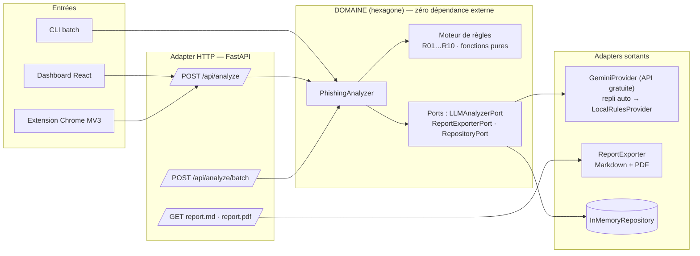

# PhishGuard AI 🛡️

**Analyseur de phishing explicable** — moteur de règles déterministes + couche LLM, avec un score traçable de 0 à 100 et des rapports d'incident exportables (Markdown/PDF).

> Projet 100 % défensif construit avec des données synthétiques. Aucun email réel, aucune donnée personnelle.

## Le problème

Les détecteurs de phishing basés uniquement sur un modèle sont des boîtes noires : impossible d'expliquer à un utilisateur *pourquoi* un email est dangereux. PhishGuard AI inverse l'approche : **le score est la somme vérifiable de règles déterministes**, et le LLM sert à valider les signaux, générer une explication en langage clair et proposer des recommandations — avec un ajustement borné à ±15 points qui ne peut jamais renverser un verdict à lui seul.

```
final_score = Σ poids(règles déclenchées)  [plafonné à 100]  +  ajustement_LLM ∈ [-15, +15]
```

## Architecture

Architecture **hexagonale (ports & adapters)** : le domaine (règles, scoring, orchestration) ne dépend d'aucune technologie. FastAPI, le LLM, ReportLab et le stockage sont des adapters branchés sur des ports — remplaçables sans toucher au cœur métier.



### Les deux couches de détection

| Couche | Rôle | Garantie |
|---|---|---|
| **Règles déterministes** (R01–R10) | Urgence linguistique, mismatch domaine affiché/réel, typosquatting (Levenshtein vs 24 domaines connus), demandes d'infos sensibles, formulations génériques, pièces jointes dangereuses (dont double extension), liens raccourcis, Reply-To divergent, usurpation de nom affiché, URL anormales (IP brute, TLD abusés) | Chaque règle est une fonction pure testée unitairement ; chaque signal porte sa **preuve** extraite de l'email |
| **Couche LLM** | Valide les signaux, détecte des indices hors règles, rédige l'explication et les recommandations | Ajustement **borné à ±15** ; l'IA enrichit, elle ne décide jamais seule. Trois providers : `LocalRulesProvider` (toujours disponible, gratuit, hors-ligne), `GeminiProvider` (vraie API gratuite optionnelle, repli automatique sur le local en cas d'échec ou de quota atteint), `MockLLMProvider` (tests/démo uniquement) |

## Résultats mesurés

Évaluation contre le dataset synthétique de **120 emails** (60 phishing / 60 légitimes, seed fixe, seuil de décision = 30) :

| Métrique | Valeur |
|---|---|
| Précision | 1.000 |
| Rappel | 1.000 |
| F1 | 1.000 |
| Exactitude | 1.000 |

⚠️ **Lecture honnête** : ces métriques parfaites reflètent un dataset synthétique généré à partir des mêmes familles de patterns que les règles. Elles servent de **garde-fou de non-régression** (le test échoue si précision < 0.95 ou rappel < 0.90), pas de prétention à la performance en conditions réelles. Sur du trafic réel, on s'attendrait à des faux négatifs sur des attaques ciblées bien rédigées — c'est précisément le rôle de la couche LLM de combler cet angle mort.

## Installation

### 🆓 Utiliser le projet gratuitement avec Gemini API Free Tier

Le projet fonctionne **entièrement gratuitement**, à deux niveaux :

1. **Sans aucune clé** : le moteur de règles local (`LocalRulesProvider`) fournit toujours le score, la classification et les raisons explicables. Rien à configurer.
2. **Avec une vraie explication IA** : Gemini API offre un Free Tier sans carte de crédit.
   - Créez une clé gratuite sur **https://aistudio.google.com/apikey**
   - `cp .env.example .env` puis remplacez `your_key_here` par votre clé
   - Ou exportez-la directement : `export GEMINI_API_KEY=...`

Le modèle par défaut est `gemini-2.5-flash` (inclus dans le Free Tier ; surchargeable via `GEMINI_MODEL`). **Si le quota gratuit est atteint (HTTP 429), si le réseau tombe ou si la réponse est malformée, l'application retombe automatiquement sur le moteur local** — l'analyse aboutit toujours. L'endpoint `/api/health` expose le provider actif et la dernière erreur Gemini éventuelle pour le diagnostic.

> Note Free Tier : sur le palier gratuit, Google peut utiliser les entrées/sorties pour améliorer ses produits — une raison de plus de n'analyser que des données synthétiques ou non sensibles.

### Option A — Docker

```bash
export GEMINI_API_KEY=...   # facultatif : sans clé, moteur local seul
docker compose up --build
# Dashboard : http://localhost:8080 · API : http://localhost:8000/docs
```

### Option B — Local

```bash
# Backend
cd backend
pip install -r requirements.txt
uvicorn app.api.main:app --port 8000

# Frontend (autre terminal)
cd frontend
npm install
npm run dev            # http://localhost:5173 (proxy /api → 8000)
```

### Extension Chrome

1. `chrome://extensions` → activer le **mode développeur**
2. **Charger l'extension non empaquetée** → sélectionner le dossier `extension/`
3. Ouvrir un email dans Gmail ou Outlook Web, cliquer sur l'icône PhishGuard, puis **Analyser** (le backend local doit tourner)

## Utilisation

```bash
# Régénérer le dataset (reproductible, seed=42)
python scripts/generate_dataset.py

# Tests unitaires + évaluation précision/rappel
python -m pytest tests/ -v

# Analyse batch d'un dossier (.eml / .json / .txt)
python scripts/batch_analyze.py backend/data/samples --out rapport_batch.md
```

L'API est auto-documentée sur `http://localhost:8000/docs` (OpenAPI/Swagger).

## Structure du projet

```
phishguard-ai/
├── backend/
│   ├── app/
│   │   ├── domain/        # hexagone : models, ports, rules (R01-R10), analyzer
│   │   ├── adapters/      # llm (Gemini + local + mock), report (MD/PDF), repository, parser .eml
│   │   └── api/           # FastAPI (adapter d'entrée HTTP)
│   └── data/              # dataset.json (120 emails synthétiques) + samples/
├── frontend/              # React + Vite : dashboard, analyse, batch, détail traçable
├── extension/             # Chrome MV3 : content script Gmail/Outlook + popup
├── scripts/               # generate_dataset.py · batch_analyze.py
├── tests/                 # 31 tests : règles, providers LLM (sans clé, repli), évaluation P/R/F1
└── docker-compose.yml
```

## Choix techniques (et leurs pourquoi)

- **Hexagonal** : le moteur de détection est testable sans FastAPI ni LLM ; brancher SQLite ou un autre modèle = écrire un adapter, zéro changement du domaine.
- **Levenshtein implémenté à la main** : ~20 lignes, aucune dépendance native, et l'algorithme est lui-même testé.
- **Ajustement LLM borné** : décision de design centrale — l'IA enrichit, elle ne décide pas seule. Le rapport affiche séparément le score des règles et l'ajustement.
- **Aucune dépendance à une API externe** : `GeminiProvider` enrichit quand il est disponible, mais `LocalRulesProvider` garantit à lui seul score + classification + raisons. Le repli est testé (quota 429, panne réseau, JSON malformé) et le mock est cantonné aux tests.
- **Repository in-memory** : suffisant pour la démo ; le port `AnalysisRepositoryPort` documente le point d'extension.

## Éthique

Le dataset est intégralement synthétique (gabarits paramétrés inspirés de patterns publics documentés) et sert exclusivement à **évaluer la détection**. Le projet n'inclut volontairement aucun outil d'envoi d'email ni de génération de contenu d'attaque.

## Licence

MIT — libre de réutilisation pour l'apprentissage et la défense.
